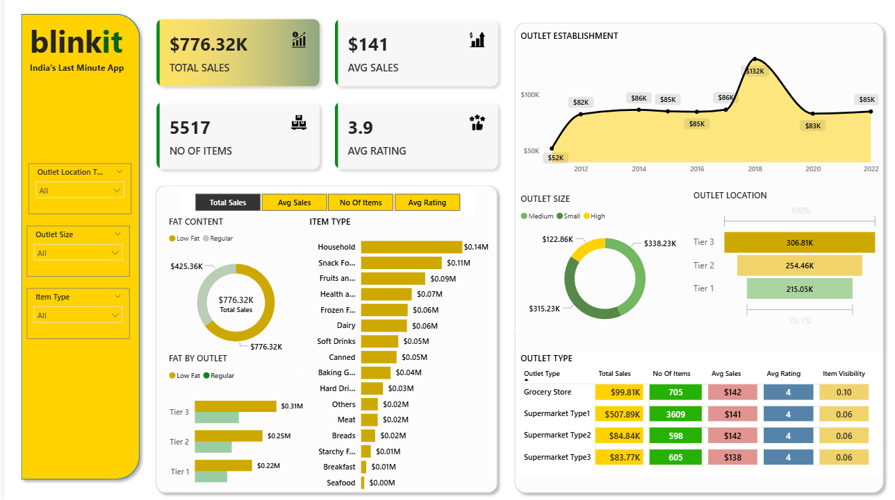

# 🛒 Blinkit Sales Analysis Dashboard – Power BI Project

A comprehensive Power BI dashboard analyzing Blinkit’s sales performance, product categories, outlet segmentation, and customer behavior.  
This project demonstrates interactive visualizations, data modeling, DAX usage, and business insights.

---

## 📸 Dashboard Preview

---

## 📊 Project Overview
This Power BI dashboard provides a complete analytical view of Blinkit's grocery sales dataset.  
It helps analyze:

- Sales performance  
- Outlet type & size comparison  
- Item category contribution  
- Fat content influence  
- Ratings & visibility trends  
- Sales growth over establishment years  

---

## 🚀 Key Insights

### **1️⃣ Overall Summary**
- **Total Sales:** $776.32K  
- **Average Sales:** $141  
- **Number of Items:** 5517  
- **Average Rating:** 3.9  

---

### **2️⃣ Category Insights**
- **Regular Fat Items** generate the majority of sales (~$425K).  
- **Household**, **Snack Foods**, and **Fruits & Vegetables** are the top-selling categories.  

---

### **3️⃣ Outlet Insights**
- **Tier 3 outlets** perform best with **$306K** sales.  
- **Medium-sized outlets** generate the highest sales (~$338K).  
- **Supermarket Type 1** contributes the largest revenue (~$507K).  

---

### **4️⃣ Sales Trend**
- Sales increased steadily over the years.  
- Peak around **2018 ($132K)**.  

---

## 🧩 Dashboard Features
- KPI cards for sales & ratings  
- Donut charts for fat content & outlet size  
- Category-wise sales bar charts  
- Outlet-wise comparison bars  
- Line chart for establishment year trend  
- Interactive filters (outlet type, size, location, item type)  
- Clean and modern Blinkit-style theme  

---

## 🛠 Tech Stack
| Tool | Purpose |
|------|---------|
| Power BI Desktop | Dashboard & modeling |
| Excel/CSV Dataset | Data source |
| DAX | Metrics & KPIs |
| GitHub | Project hosting |

---

## 📁 Project Structure

---

## 📥 How to Use This Project
1. Download the `.pbix` file.  
2. Open it in **Power BI Desktop**.  
3. Explore the interactive visuals.  
4. Apply filters for deeper insights.  

---

## 🧠 Business Recommendations
- Expand **Tier 3** and **medium-sized** outlets — they perform best.  
- Focus promotion on **Household**, **Snack Foods**, and **Fruits & Vegetables**.  
- Improve **visibility** in grocery stores.  
- Increase attention to **Low Fat** category for balanced growth.  

---

## 🏁 Conclusion
This dashboard provides an end-to-end analysis of Blinkit’s sales and helps understand business performance using data-driven insights.  
Perfect for showcasing **Power BI, data analytics, and visualization skills**.

---

